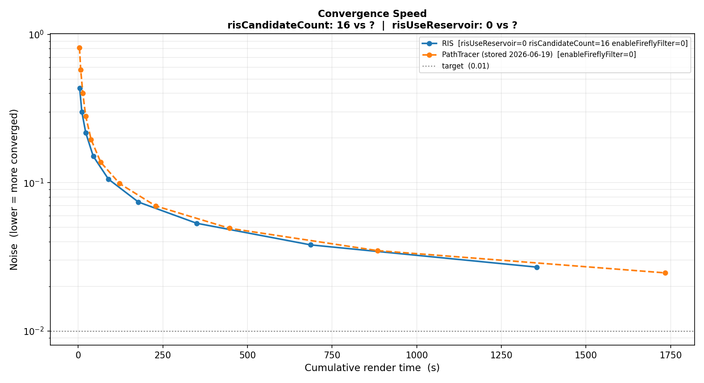
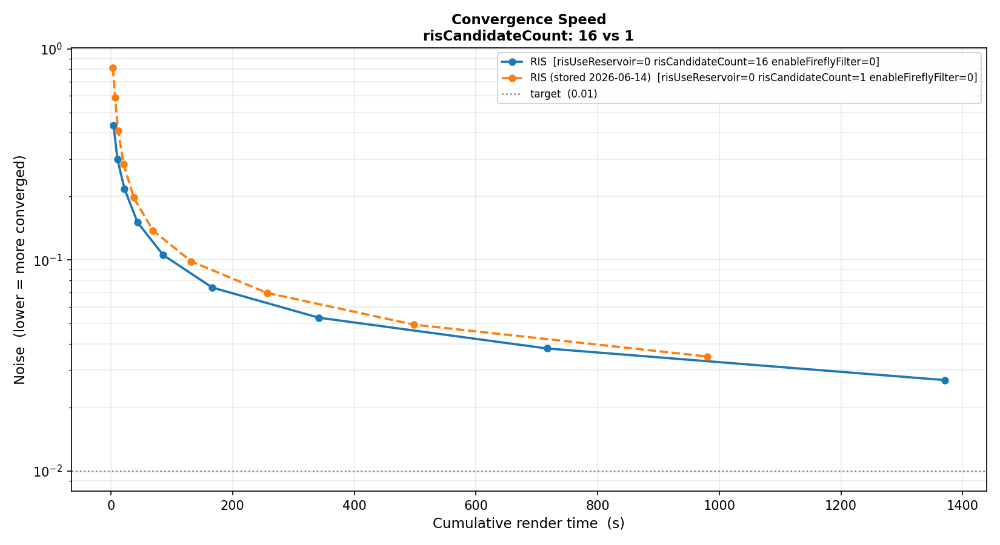
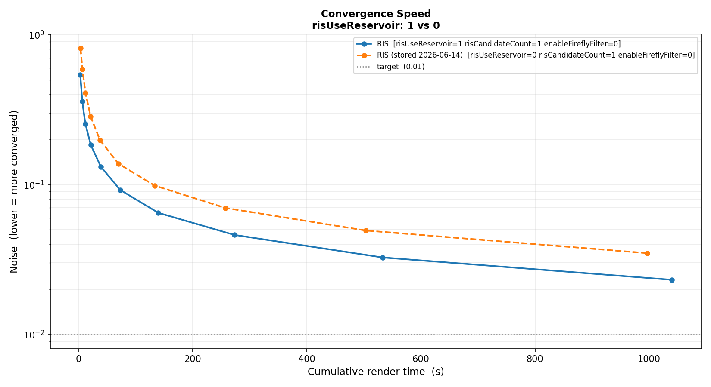
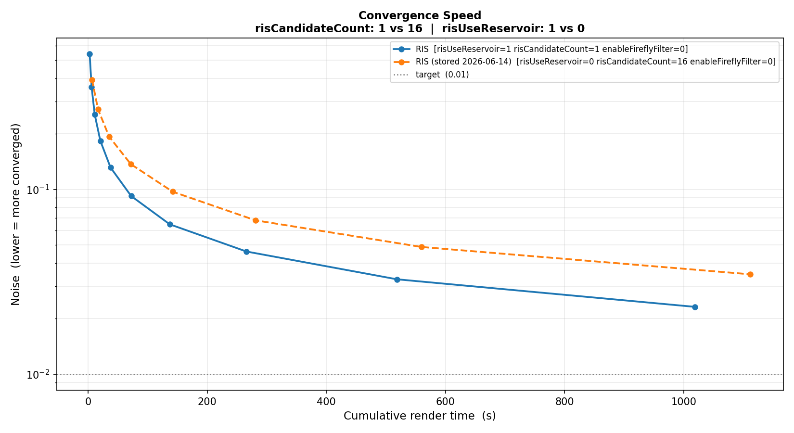
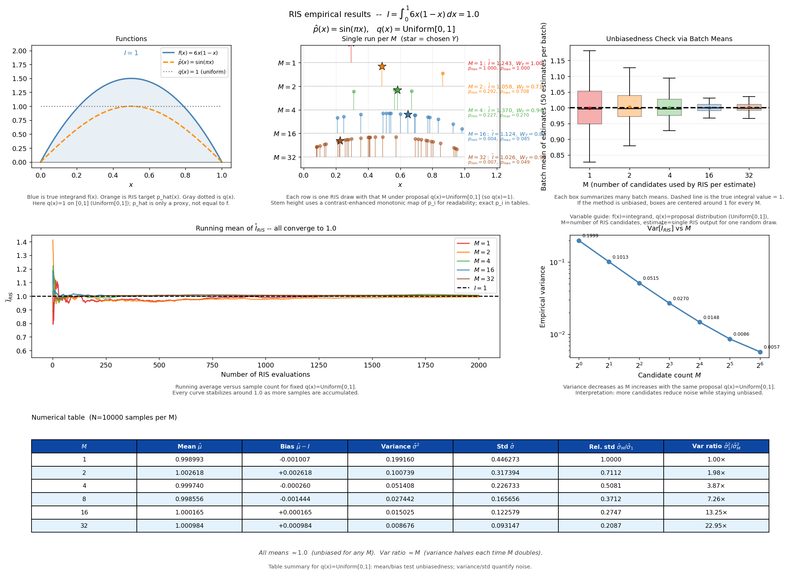

# HdRestir 👁️‍🗨️

A spectral [Hydra](https://openusd.org/release/glossary.html#hydra) render delegate for [OpenUSD](https://openusd.org) that implements [ReSTIR](https://intro-to-restir.cwyman.org/presentations/2023ReSTIR_Course_Notes.pdf) and a reference path tracer, built as a learning project to explore advanced Monte Carlo sampling techniques in a production rendering framework. Light transport is computed across 4 wavelength samples per ray (360–830 nm) and converted to RGB at output.

---

## Origin & motivation 

This project was inspired by [**hdGemini**](https://github.com/pembo/hdGemini) by [Paolo Emilio Selva](https://github.com/pembo). Seeing how easily a custom renderer could plug into OpenUSD's pipeline made the whole idea feel very tangible.

From there, two threads of curiosity converged: I wanted to get hands-on with [ReSTIR](https://intro-to-restir.cwyman.org/presentations/2023ReSTIR_Course_Notes.pdf) and I also wanted to properly understand how **[Hydra plugins](https://openusd.org/dev/api/_page__hydra__getting__started__guide.html)** work from the inside.

---

## ReSTIR?

Standard path tracers spend most of their budget evaluating light samples that contribute little to the final image. **RIS** addresses this by drawing many cheap candidate samples and selecting one proportionally to how much it actually contributes — the retained sample is an unbiased estimator of the true integral, but with far lower variance.

**ReSTIR** (Reservoir-based Spatiotemporal Importance Resampling) takes this further: instead of discarding the losing candidates, it stores the selection state in a compact *reservoir* that can be reused across frames or neighboring pixels. This project implements the core of this idea as a Hydra plugin, letting it run directly inside **usdview** with no external renderer required.

---

Built with CMake + vcpkg · C++20 · ✅ macOS · ⬜ Linux · ⬜ Windows

---

## Architecture

The plugin is structured as a pipeline of composable render passes. On each render call the active pipeline executes in order, writing intermediate results into named frame buffers that subsequent passes can consume.

→ Class diagrams, sequence diagrams, and package dependency graph: **[docs/ARCHITECTURE.md](docs/ARCHITECTURE.md)**

---

## Getting started 🚀

### Build

```bash
# macOS / Linux
./make.sh

# Windows
make.bat
```

### `make.sh` / `make.bat` — build and everything else

Installs [just](https://github.com/casey/just) if it isn't already on your PATH, then forwards all arguments to it. Default (no args) builds the plugin. All dependencies (OpenUSD, TBB, vcpkg packages) are pulled in automatically. This is the entry point for all CI-style operations: build, test, capture, perf.

```bash
./make.sh                              # build
./make.sh debug-test                   # debug build + full test suite
./make.sh capture scene.usda out.png   # headless render
```

| Command | What it does |
|---|---|
| `./make.sh` | Compile the plugin |
| `./make.sh debug` | Debug build |
| `./make.sh launch <scene.usda>` | Open usdview (builds first if needed) |
| `./make.sh capture <scene.usda> <out.png>` | Headless render to file |
| `./make.sh test-smoke` | Fast smoke tests |
| `./make.sh test-all` | Full test suite |
| `./make.sh debug-test` | Debug build + full test suite |
| `./make.sh perf-store` | Save performance baselines |
| `./make.sh perf-test` | Compare pipelines against stored baselines |
| `./make.sh perf-test-graph` | Render a convergence graph PNG |
| `./make.sh test-and-perf` | Build + test + perf regression in one shot |

### `launch.sh` / `launch.bat` — open usdview without building

A focused shortcut that skips the build entirely and just opens usdview with the already-compiled plugin. Use this when iterating on a scene file or on `settings/RenderSetup.usda` — no C++ changes, no need to wait for a rebuild.

```bash
./launch.sh                                         # opens example_scenes/scene.usda
./launch.sh example_scenes/many_lights_scene.usda   # specific scene
```

Three example scenes are included in `example_scenes/`: `scene.usda`, `mis_area_lights_scene.usda`, and `many_lights_scene.usda`.

---

## How it was built — commit by commit 🧱

Each commit introduces one well-scoped concept on top of the previous one. You can check out any commit to see the project at that exact stage, or browse the diffs on the linked blog posts below. *(post links coming soon)*

---

### `e6fe6bb` — First commit: the path tracer

> *A fully working Hydra render delegate, from zero.*

The entire plugin skeleton lands here: Hydra delegate, render pass, render buffer, mesh sync, material (UsdPreviewSurface + GGX), lights (dome, rect, point, distant, physical sky), BVH, camera rays, accumulation, OIDN denoiser, post-processing (depth of field, lens flare, chromatic aberration, upscale), split-screen compositor, AOVs, and a first test suite. By the end of this commit you have a working path tracer you can open in `usdview` and see pixels.

The structure follows the Hydra contract closely: `HdRestirRenderDelegate` → `HdRestirRenderPass` → `Renderer` → `RenderPipeline` → individual passes. Everything is already designed to be swappable.

---

### `e6fb9bb` — Integrator and light sampler abstraction

> *Separate what to integrate from how to trace rays.*

The direct-lighting logic is pulled out of the path trace pass and placed behind a clean `DirectLightIntegratorInterface`. A `MISDirectLightIntegrator` is introduced — it samples each area light with both BSDF and light strategies and combines them with MIS weights, which is the correct way to handle hard-to-sample configurations. A `UniformLightSampler` provides the basic light-selection layer.

Two new example scenes arrive: `mis_area_lights_scene.usda` (tests MIS between small and large lights) and `many_lights_scene.usda` (stress-tests the light sampler with many emitters). This refactor is the prerequisite for plugging in a RIS integrator: any `DirectLightIntegrator` can now be dropped in without touching the pipeline.

---

### `497ce35` — Direct light integration with RIS

> *The first appearance of RIS in the renderer.*

`ris_direct_light_integrator.cpp` implements the core algorithm: for each shading point, draw `N` candidate lights from the scene, compute a weight proportional to the target contribution (BSDF × emission / pdf), and select one via those weights. The selected sample is an unbiased estimator of the sum with far lower variance than picking a single light at random.

Before writing a single line of 3D renderer code, the math is verified in isolation: `exploratory_tests/restir/ris_1d.py` runs the estimator on a known 1D integral and plots convergence tables, bias checks, and variance-vs-M curves. `ris_mis_two_techniques.py` extends this to the two-technique MIS case. Only once those pass does the implementation enter the renderer.

A new `ris_pipeline.h` and `ris_path_trace_pass.h` wire the RIS integrator into the pipeline system as a first-class selectable pipeline alongside the path tracer.

---

### `466b897` — RenderSetup USD, split-screen controls, debug overlay

> *Make it comfortable to iterate and compare.*

`settings/RenderSetup.usda` is introduced — a USD file that carries render settings (pipeline choice, sample counts, RIS parameters) separately from the scene. You can swap configurations without touching your scene files.

A `DebugOverlayPass` is added: it renders text labels and stats directly onto the frame buffer, so in split-screen mode you can immediately see which pipeline is on which side. The split-screen compositor gains independent left/right pipeline configuration. Passes are refactored to explicitly declare their named inputs and outputs, so the pipeline compiler can skip passes whose outputs aren't needed for the current AOV request.

---

### `1035359` — clang-format

> *One formatting pass across the whole codebase.*

`.clang-format` is introduced and applied to all 133 source files. No logic changes — just consistent style from here on. Pre-commit hooks (`pre-commit-config.yaml`) enforce it going forward.

---

### `e6bc4dc` — ReSTIR reservoir + performance metrics

> *The reservoir arrives. This is what the project was building toward.*

`source/restir/reservoir.h` implements the `Reservoir<T>` data structure: a streaming weighted-random sampler that retains the single best candidate seen so far along with the sum of weights. The RIS integrator is refactored to use it — candidates are fed into the reservoir one by one, and the retained sample is passed to shading. Crucially, `buffer_provider.h` / `buffer_user.h` let integrators read and write named frame buffers that persist across render calls, enabling the reservoir to accumulate across frames.

The full performance testing infrastructure ships alongside: `tests/perf_test.py` can run either pipeline to a target noise level and store the convergence curve as JSON. `tests/perf_report.py` renders an HTML report. `just perf-*` recipes expose everything from the command line. The four convergence graphs in `graphs/` are the output of this infrastructure.

---

## Configuration

### RenderSetup.usda

`settings/RenderSetup.usda` is a USD file that carries all render settings as USD attributes and **variant sets**, keeping configuration out of the scene file. Reference it as a sublayer when opening a scene in usdview, or pass individual settings via `--render-setting` flags through the workflow.

The key thing it exposes is a `pipelineMode` variant set with three named modes:

| Variant        | `restir:primaryPipeline` | `restir:ris:useReservoir` | What it does                                                                       |
| -------------- | -------------------------- | --------------------------- | ---------------------------------------------------------------------------------- |
| `PathTracer` | `PathTracer`             | —                          | Unidirectional path tracer, one direct-light sample per bounce                     |
| `RIS`        | `RIS`                    | `false`                   | Draws N candidate lights per pixel, selects one by weight — no cross-frame memory |
| `RESTIR`     | `RIS`                    | `true`                    | RIS + reservoir accumulation across frames — this is the main result              |

A matching `splitScreenRightPipelineMode` variant set controls the right half of the split-screen compositor independently.

### Render settings reference

All settings live under the `restir:` namespace and are visible in the usdview **Render Settings** panel.

| Setting                        | USD token                            | Default        |
| ------------------------------ | ------------------------------------ | -------------- |
| **Pipeline**             |                                      |                |
| Primary pipeline               | `restir:primaryPipeline`           | `PathTracer` |
| Enable split screen            | `restir:splitScreen:enable`        | `false`      |
| Target sample count            | `restir:targetSampleCount`         | `32`         |
| Resolution level (0 = native)  | `restir:resolutionLevel`           | `2`          |
| **RIS / ReSTIR**         |                                      |                |
| Candidate count                | `restir:ris:candidateCount`        | `16`         |
| Use reservoir (enables ReSTIR) | `restir:ris:useReservoir`          | `true`       |
| **Path tracing**         |                                      |                |
| Enable subsurface scattering   | `restir:path:enableSubsurface`     | `true`       |
| Max reflection bounces         | `restir:path:maxReflectionBounces` | `8`          |
| Max refraction bounces         | `restir:path:maxRefractionBounces` | `8`          |
| Render IBL background          | `restir:path:renderIblBackground`  | `true`       |
| **Denoiser**             |                                      |                |
| Enable OIDN denoiser           | `restir:denoiser:enable`           | `true`       |
| Firefly filter                 | `restir:denoiser:fireflyFilter`    | `true`       |
| **Camera**               |                                      |                |
| Enable depth of field          | `restir:camera:depthOfField`       | `false`      |
| Focal length (mm)              | `restir:camera:focalLength`        | `50`         |
| f-stop                         | `restir:camera:fStop`              | `5.6`        |
| Focus distance                 | `restir:camera:focusDistance`      | `10`         |
| Bokeh blades (0 = circular)    | `restir:camera:bokehBlades`        | `0`          |
| Physical exposure              | `restir:camera:physicalExposure`   | `false`      |
| ISO                            | `restir:camera:iso`                | `100`        |
| Shutter speed (s)              | `restir:camera:shutterSpeed`       | `0.02`       |
| **Sky**                  |                                      |                |
| Enable physical sky            | `restir:sky:enable`                | `false`      |
| Time of day                    | `restir:sky:timeOfDay`             | `12`         |
| **Debug**                |                                      |                |
| Debug overlay                  | `restir:debug:overlay`             | `false`      |

---

## Performance analysis

### How perf-test works

The graphs and numeric comparisons below are generated by `tests/perf_test.py`. The workflow is always two steps:

**1. Store a baseline** — render a pipeline to a target noise level and save the convergence curve as JSON in `performance_reference/<scene>/`:

```bash
./make.sh perf-store                                      # default scene, all pipelines
./make.sh perf-store RIS "" 0.005                        # RIS only, convergence target noise ≤ 0.005
./make.sh perf-store "" mis_area_lights_scene.usda       # specific scene, all pipelines
./make.sh perf-store "" all                              # all scenes in example_scenes/
```

**2. Compare against it** — re-render and report the delta. Exits non-zero on regression:

```bash
./make.sh perf-test                                      # all pipelines vs their stored baselines
./make.sh perf-test RIS "" PathTracer                   # RIS vs stored PathTracer baseline
./make.sh perf-test "" mis_area_lights_scene.usda       # specific scene
./make.sh perf-test "" all                              # all scenes
```

The comparison metric is **time to reach the same noise level**. A pipeline that reaches a target RMSE in less time is strictly faster. This is more informative than equal-sample-count comparisons, because pipelines with heavier per-sample cost (e.g. RIS with 16 candidates) can still win overall by producing much better samples.

Running `./make.sh perf-test RIS "" PathTracer` with RIS configured at 16 candidates shows a **~25% render-time improvement** over PathTracer on the reference scene — something the convergence graphs alone make hard to read because the RMSE curves look similar.

Stored baselines live in `performance_reference/` as JSON files with the full convergence curve, render times, and settings. They are versioned so regressions can be caught across code changes.

---

### Convergence graphs

The graphs below plot **noise (log-scale RMSE, lower = cleaner)** against **cumulative render time**. Each dot is one doubling of sample count. All measurements on the internal reference scene.

### RIS (16 candidates, no reservoir) vs PathTracer

The RMSE curves track closely on the graph, but the perf-test makes the advantage concrete: RIS with 16 candidates reaches the same noise level ~25% faster than PathTracer. The graph is a useful shape check; the numeric comparison is the reliable signal.



---

### Effect of candidate count (1 vs 16, no reservoir)

More candidates per pixel produces a better-quality sample at the cost of more ray evaluations. The curves show that 16 candidates converges faster per unit of wall time than 1 candidate — the quality gain more than pays for the extra cost.



---

### Effect of reservoir resampling (on vs off)

This is the key result. With reservoir resampling enabled and only 1 candidate, convergence is **substantially faster** than plain RIS with 16 candidates. The reservoir accumulates importance samples across frames, amplifying each frame's contribution without re-evaluating candidates — this is the core ReSTIR insight.



---

### Combined: reservoir × candidate count tradeoff

Reservoir + 1 candidate vs plain RIS + 16 candidates side-by-side. The reservoir configuration reaches the same noise level in roughly half the time, confirming that cross-frame reuse is a larger win than throwing more candidates per frame.



---

## Exploratory tests

`exploratory_tests/restir/` contains standalone Python experiments that verify the math before it was implemented in C++.

**`ris_1d.py`** — runs the RIS estimator on a known 1D integral. Each row below is a different candidate count `M`. Variance decreases proportionally to `M` and the running mean converges to the true value (1.0), confirming the estimator is unbiased.



**`ris_mis_two_techniques.py`** — extends the 1D case to the two-technique MIS scenario (BSDF + light sampling), verifying the combined weight formula is unbiased and that variance reduces correctly as `N` grows.

---

## License

See [LICENSE](LICENSE).
