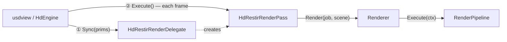
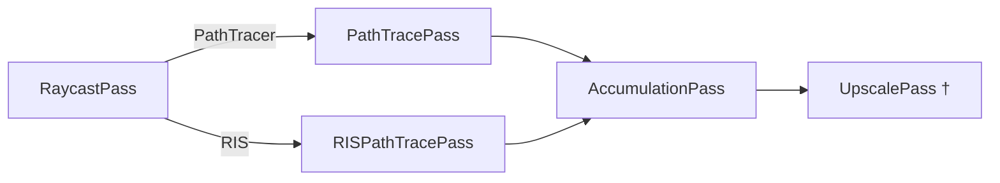
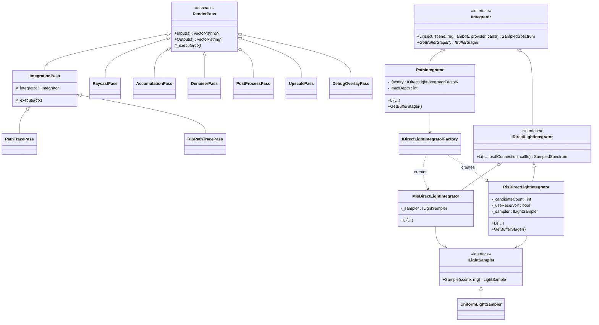
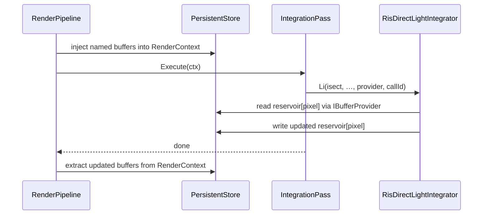
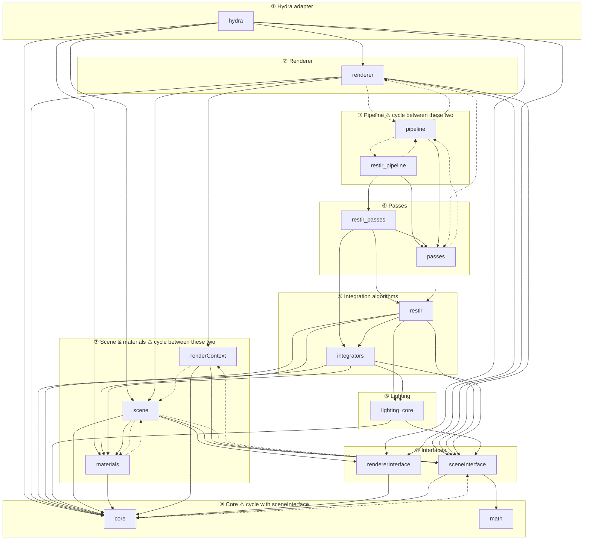

# HdRestir — Architecture

Companion to [README.md](../README.md). Covers class structure, data flow, and the package dependency rules that govern how the codebase should be split into independent libraries.

---

## Hydra integration

HdRestir plugs into OpenUSD's Hydra rendering framework as a custom `HdRenderDelegate`. Hydra drives the rendering loop: it syncs scene prims into the delegate and calls `Execute()` on the render pass each frame. The delegate creates the render pass at startup and owns the `Renderer` and scene state.

---

## Pipeline structure

Both pipelines are compiled at runtime from a declared list of passes. The compiler walks the pass list in reverse, keeping only passes whose outputs are reachable from the requested AOVs — so requesting only `color` skips the depth pass automatically.

† included only when `resolutionLevel > 0`.

A `PathTracerPostProcess` variant (with `DenoiserPass` and `PostProcessPass`) is fully implemented but not registered as a selectable pipeline yet.

---

## Pass and integrator class hierarchy

The key design point: swapping the lighting algorithm requires only changing the `IDirectLightIntegrator` inside `PathIntegrator`. The pipeline, accumulation, and all other passes are identical between PathTracer and RIS.

`PathTracePass` wires `PathIntegrator` + `MisDirectLightIntegrator` (MIS between BSDF and light strategies).
`RISPathTracePass` wires `PathIntegrator` + `RisDirectLightIntegrator` (candidate-weighted reservoir selection).

---

## Cross-frame reservoir: persistent buffer flow

The reservoir must survive across render calls so it can accumulate importance samples over many frames. Rather than making passes stateful, the pipeline owns a `PersistentStore` and injects named buffers into the render context before each pass execution, then extracts them afterward. Passes and integrators remain stateless.

---

## Package dependency graph

Each `source/` subfolder is a **package** — an independent compilation unit intended to become its own shared library. Dependencies must flow strictly downward from volatile (top) to stable (bottom). Dashed edges are **violations**: cycles or upward dependencies that must be resolved before the packages can be split into separate DLLs.

### Violation summary

| Packages                                                         | Cause                                                                                                                                                        | Fix                                                                                         |
| ---------------------------------------------------------------- | ------------------------------------------------------------------------------------------------------------------------------------------------------------ | ------------------------------------------------------------------------------------------- |
| `renderer` ↔ `pipeline`                                     | `restir_render_settings.h` is in `renderer` but pipeline compilation needs it; `renderer_pipeline_state.h` is in `pipeline` but renderer includes it | Move render-settings tokens into a shared `settings` package below both                   |
| `passes` ↔ `pipeline`                                       | `RenderPipeline` lives in `pipeline` but some pass headers include it                                                                                    | Move `render_pipeline.h` down into `passes`                                             |
| `pipeline` ↔ `restir_pipeline`                              | Each includes the other's pipeline factory header                                                                                                            | Merge `restir_pipeline` into `pipeline`                                                 |
| `renderer` → `passes`                                       | `Renderer` directly includes `path_trace_pass.h` for its settings struct                                                                                 | Extract `PathTracePassSettings` into `rendererInterface`                                |
| `passes` → `restir`                                         | Name collision between `passes/output_names.h` and `restir/output_names.h`                                                                               | Consolidate into `passes` only                                                            |
| `materials` ↔ `scene`                                       | `image_texture_sampler.h` lives in `scene` but materials uses it                                                                                         | Move `image_texture_sampler` into `materials`                                           |
| `core` ↔ `sceneInterface` ↔ `renderContext` ↔ `scene` | Scene interface types and render context are interleaved with core types across four packages                                                                | Merge `sceneInterface` into `core`; make `renderContext` a clean consumer of `core` |
